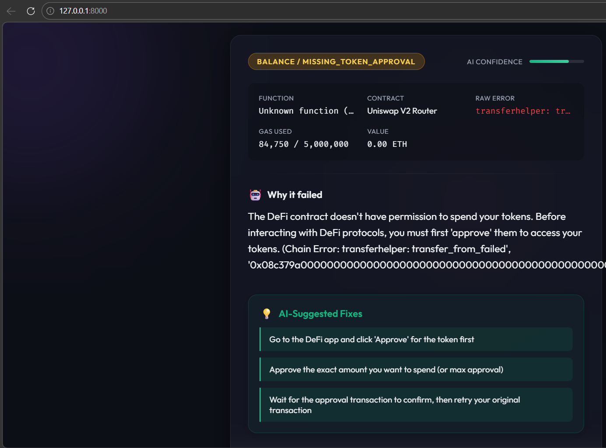

# 🧠 ExplainDeFi: AI Agent for Transaction Failure Diagnosis



**ExplainDeFi** is a high-performance, multi-agent AI system designed to solve one of the most frustrating problems in Decentralized Finance (DeFi): **cryptic transaction failures.** 

Instead of seeing "execution reverted," users get a clear, human-readable explanation of *why* their transaction failed and **exactly how to fix it.**

---

## 🚀 Core Features

-   **Multi-Agent Intelligence:** A 5-stage pipeline that deconstructs transactions in real-time.
-   **Smart Contract Analysis:** "Reads" verified Solidity code (ABI & Source) to find `require()` triggers and custom error codes.
-   **AI-Suggested Fixes:** Provides actionable steps (e.g., "Increase slippage to 2.5%") to get your transaction through.
-   **Success Highlighting:** Distinct celebratory theme for successful transactions with clear metadata display.
-   **Premium Glassmorphism UI:** A stunning, responsive dark-mode interface designed for high-end Web3 users.

---

## 🛠️ The 5-Agent Pipeline

The system uses a sequential orchestration model where each agent specializes in one layer of the diagnosis:

### 1. 📡 TxDataAgent (Data Retrieval)
-   Connects to Ethereum via **Alchemy RPC**.
-   Fetches transaction object, receipt, and logs.
-   Replays failed transactions via `eth_call` to extract the hidden **revert reason**.

### 2. 🔎 FailureDetectionAgent (Deterministic Logic)
-   Applies 20+ deterministic rules to classify common failures (Out of Gas, Slippage, Balance, etc.).
-   Decodes **Custom Error Selectors** from Uniswap V3 and modern Solidity contracts.
-   Ensures 100% accuracy for known patterns before involving AI.

### 3. 🔬 ContractInspectorAgent (On-Chain Context)
-   Fetches contract **ABI** and verified **Source Code** via Etherscan.
-   Decodes the called function name and parameters.
-   Extracts `require()` statements and developers' internal error messages.

### 4. 🤖 ExplanationAgent (AI Synthesis)
-   **Primary Model:** Google **Gemini 2.0 Flash** (with automatic model-rotational fallback to 1.5 Flash).
-   Translates technical data + contract code into plain English.
-   Generates the **Suggested Fixes** list based on the detected error.

### 5. 💾 ExecutorAgent (Persistence)
-   Saves diagnosis reports to a **SQLite** database.
-   Handles caching for fast retrieval of previously diagnosed hashes.
-   Formats the final JSON response for the frontend.

---

## � Tech Stack

-   **Backend:** FastAPI (Python 3.9+)
-   **Blockchain:** Web3.py, Alchemy, Etherscan API
-   **AI Models:** Google Gemini (Primary), Groq/OpenAI (Fallbacks)
-   **Database:** SQLite3
-   **Frontend:** Vanilla JS, HTML5, CSS3 (Glassmorphism & Rich Animations)

---

## 🏁 Getting Started

### 1. Environment Setup
Clone the repository and create your `.env` file from the example:
```bash
cp .env.example .env
```

### 🔑 Key Acquisition Guide
To fully power the 5-agent pipeline, you will need the following free API keys:

1.  **Alchemy (Blockchain Data):**
    -   Go to **[Alchemy Dashboard](https://dashboard.alchemy.com/)**.
    -   Create a new App on local **Ethereum Mainnet**.
    -   Copy your **API Key** and paste it into `ALCHEMY_API_KEY` and the end of `ETHEREUM_RPC_URL`.

2.  **Etherscan (Smart Contract Context):**
    -   Create an account at **[Etherscan.io](https://etherscan.io/register)**.
    -   Navigate to **[API Keys](https://etherscan.io/myapikey)** and generate a new key.
    -   Paste it into `ETHERSCAN_API_KEY`.

3.  **Google Gemini (AI Explanation):**
    -   Visit **[Google AI Studio](https://aistudio.google.com/app/apikey)**.
    -   Click **"Create API key"**.
    -   Paste it into `GEMINI_API_KEY`. (Note: The **Free Tier** is supported with our built-in retry logic!).

### 2. Install Dependencies
```bash
pip install -r requirements.txt
```

### 3. Run the Application
```bash
uvicorn api.main:app --host 127.0.0.1 --port 8000
```
Visit **[http://127.0.0.1:8000](http://127.0.0.1:8000)** to start diagnosing.

---

## 🏗️ Architecture Design
The project uses a **Modular Agentic Workflow**. Unlike simple LLM wrappers, ExplainDeFi follows a "Deterministic First" philosophy:
1.  **Technical Phase:** Agent 1 (RPC) and Agent 2 (Regex/Rules) extract hard truths from the chain.
2.  **Context Phase:** Agent 3 (Etherscan) reads the actual contract code.
3.  **Synthesis Phase:** Agent 4 (Gemini AI) combines the code + technical error into a human explanation.

This structure ensures that the explanation is grounded in **real code logic**, not AI hallucinations.

---


